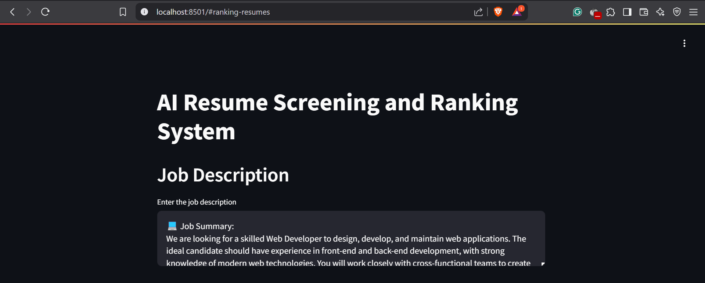
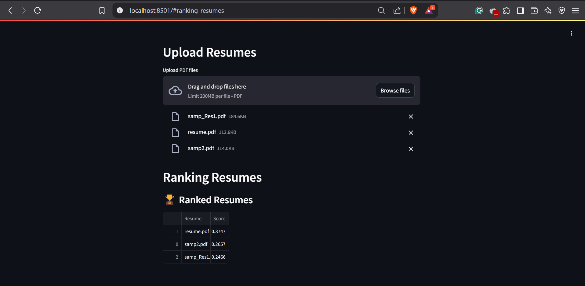

# 📝 AI Resume Screening and Ranking System  

An AI-powered resume screening tool built with **Python, Streamlit, and Scikit-Learn**. It ranks resumes based on relevance to a given job description using **TF-IDF vectorization and cosine similarity**.  

## 📌 Features  
✅ Upload multiple resumes (PDF)  
✅ Compare resumes with job descriptions  
✅ Get ranked results based on relevance  

## 🚀 How It Works  

### 1️⃣ Enter Job Description  
  

### 2️⃣ Upload Resumes (pdf) & View Ranking  
  

## 📦 Installation  
1. Clone the repository:  
   ```bash
   git clone https://github.com/jyot5na/resume-screening.git
   cd resume-screening

2. Install dependencies:
   ```bash
   pip install -r requirements.txt

4. Run the Streamlit app:
   ```bash
   streamlit run resume_ranker.py

## 🗝️ Future Scope
1. AI-Powered Scoring
-Train a machine learning model (e.g., Random Forest, SVM) to predict resume suitability based on past hiring decisions.
-Use deep learning (LSTMs or Transformers) for contextual resume matching.

2. File Support
-Support image-based PDFs using OCR (Tesseract).
-Accept other formats like DOCX and TXT in addition to PDFs.
